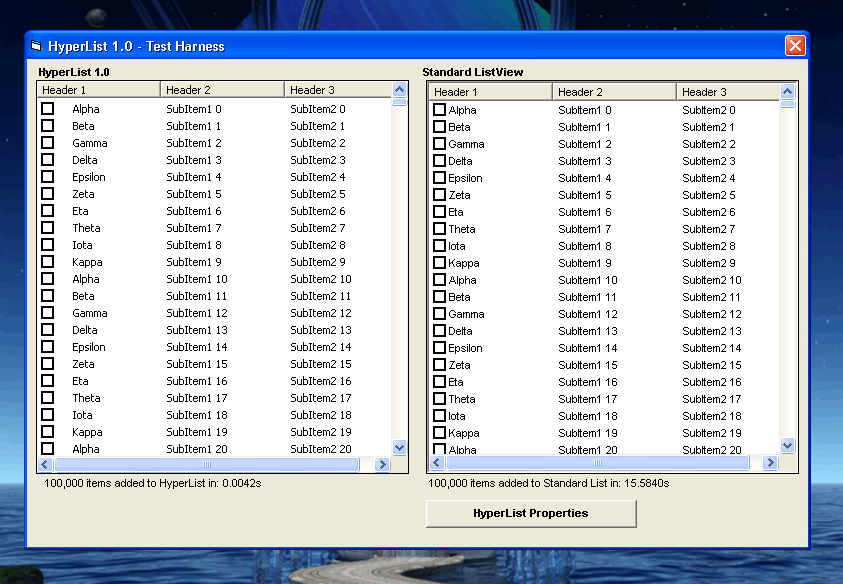



## HyperList\! V3 \- Add 100,000 Items to a Listview in \.004 seconds\.\.

### Description

A fully implemented virtual/stateful listview control, with unbelievable speed. Built in storage and sorting capabilities, with database connector options. Owner drawn, with potential and methods demonstrated for more serious modifications.

Many extended styles and methods demonstrated, in what is, without a doubt, the fastest fully implemented listview control in visual basic.

----

V2 Is Up!

Fixed a few things, added icons to some views, and added a usecontrol version.

----

V3 Is Up!

Icon problems resolved in both uc and dll versions. Tab control also added to both revisions.

Have fun..

Cheers

John
 
### More Info
 

             |
---                |---
**Submitted On**   |2006-06-29 03:27:42
**By**             |[Steppenwolfe](https://github.com/Planet-Source-Code/PSCIndex/blob/master/ByAuthor/steppenwolfe.md)
**Level**          |Intermediate
**User Rating**    |5.0 (144 globes from 29 users)
**Compatibility**  |VB 6\.0
**Category**       |[Complete Applications](https://github.com/Planet-Source-Code/PSCIndex/blob/master/ByCategory/complete-applications__1-27.md)
**World**          |[Visual Basic](https://github.com/Planet-Source-Code/PSCIndex/blob/master/ByWorld/visual-basic.md)
**Archive File**   |[HyperList\!2003366292006\.zip](https://github.com/Planet-Source-Code/steppenwolfe-hyperlist-v3-add-100-000-items-to-a-listview-in-004-seconds__1-65746/archive/master.zip)

